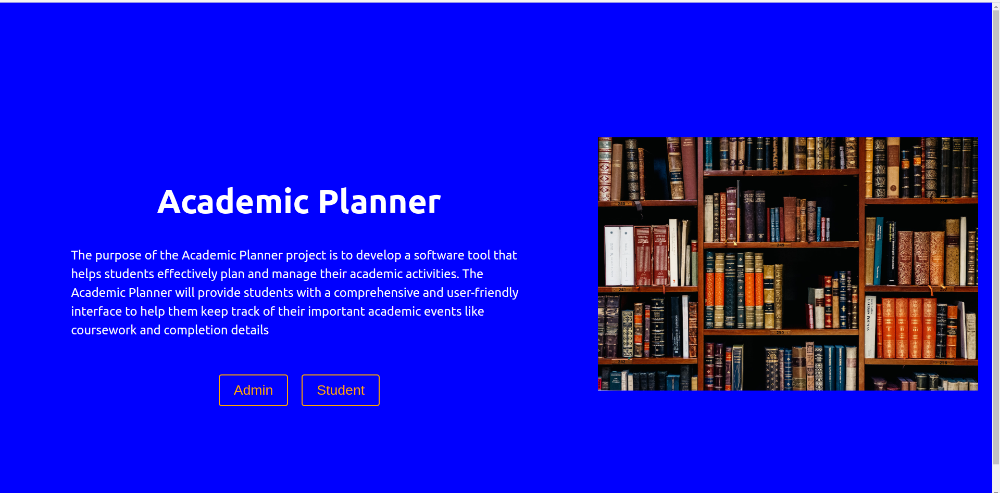
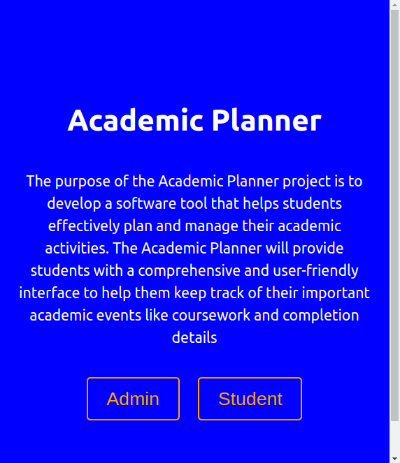
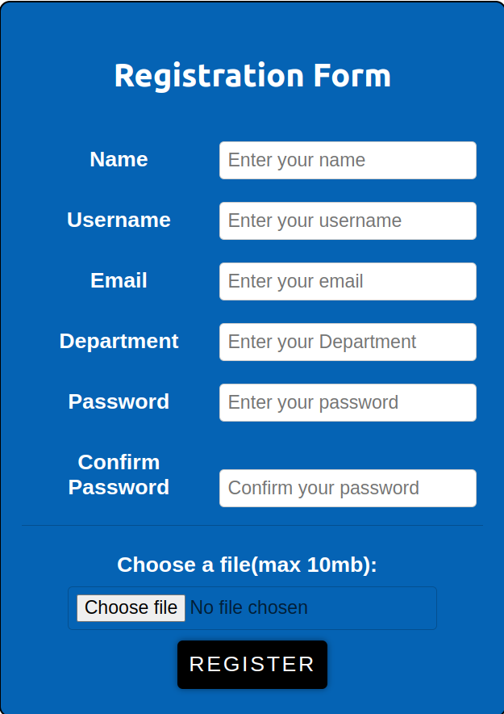
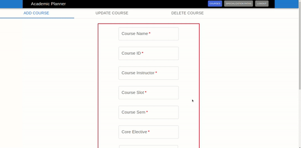
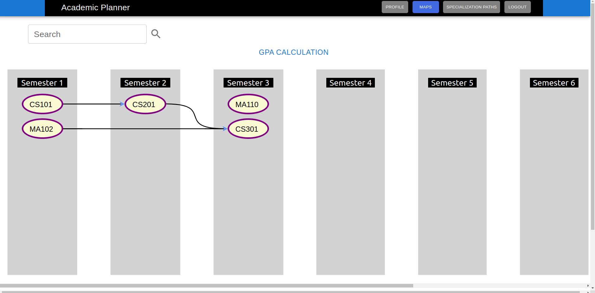
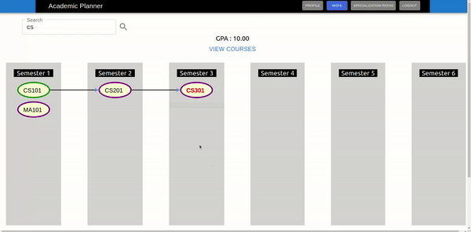
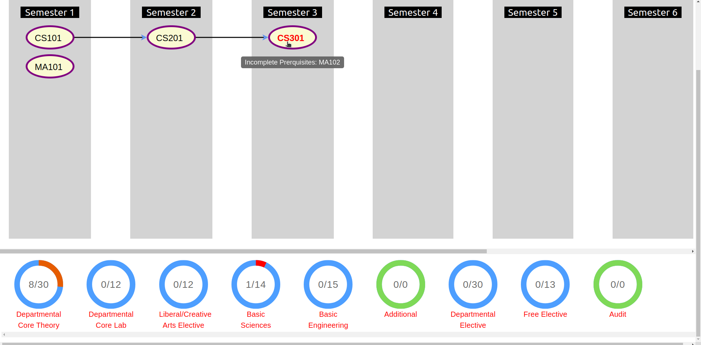
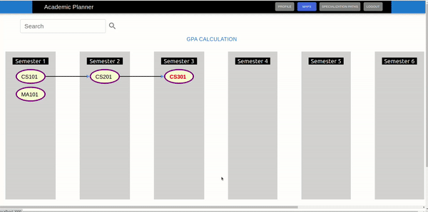
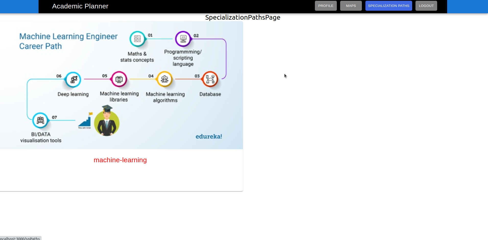

# Academic-Planner
## CS4443 Software Engineering Course project

### Motive:
The purpose of the Academic Planner project is to develop a software tool that helps students effectively plan and manage their academic activities. The Academic Planner will provide students with a user-friendly interface to help them keep track of their important academic events like course registration and completion details. With the help of this tool, students will be able to create a personalised academic plan, take notes, and stay on top of their academic responsibilities.

In addition to serving as an academic planning tool, the Academic Planner will help students monitor their academic progress and performance. The software will give students meaningful insights into their academic performance, including grades, grade distribution, and performance trends. This information will help students identify areas to improve, set achievable goals, and take proactive steps to enhance their academic performance.

### Key Features:
- Student can track academic progress.
- CGPA will be automatically calculated with an option provided to student to estimate.
- All the elective counts will be displayed.
- CGPA trends are displayed which shows the variation in progress.
- Courses with prerequisites are handled with special care.

These are some of the key features of the product but is not limited to.

### Technologies used:
#### Backend:
We've chosen Python as our main language of backend. In specific, we used Flask framework. With many choices out there, we chose this experimentally to work and know better how this flavour interacts with frontend.
#### Frontend:
As the product expects to be responsive and reactive all the times, we chose to go with React. It has all the utility libraries which is needed for making the frontend.
#### Database:
We've gone with MongoDB as our database as it is already horizontally scaled. Also, it provides a great flexibility to deal with unstructured data which is the major benefit in this problem.

### How to run:
- Create a virtual enviroment in order to not interfere with the system wide installations/dependencies.

#### Backend:
- Go to Backend folder
- Set all the configurations in ```config.py``` file
```
	$ pip install requirements.txt
	$ flask run
```
- This starts the backend.

#### Frontend:
- Go to Frontend folder
- Save it in the directory level, global level installations are not advised.
```
	$ npm i package.json
	$ npm run start
```

#### Database:
- We've used MongoDB Atlas for the project.
- Provide proper details in Backend ```config.py``` in order for the database to work.
- All the fields in ```config.py``` are self explanatory.

### Screenshots and Demo's:

* Home, SignIn, and SignUp screenshots
 


<div style="display:flex">
     <div style="flex:1;padding-right:10px;">
        
		<figcaption>Responsive Home Page</figcaption>
     </div>
     <div style="flex:1;padding-left:10px;">
        
		<figcaption>Registration Form in SignUp Page</figcaption>
     </div>
</div>


* Admin UI
<figure>
  
</figure>

* Student course-maps Page

<figure>
  
  <figcaption>Landing Page for Students</figcaption>
</figure>

<figure>
  
  <figcaption>GPA Estimation</figcaption>
</figure>

<figure>
  
  <figcaption>Course Prerequisites, and Circular Progress bars</figcaption>
</figure>

* Student Profile Page UI

<figure>
  
</figure>


* Specialization Paths Page
<figure>
  
</figure>


## Contributors:
[Uppala Sehouriey](https://github.com/Sehouriey)  
[Sri Hari M](https://github.com/srihari39)  
[Geetha Sowmya Ch](https://github.com/Geetha495)  
[Sri Harsha K](https://github.com/Harsha24112002)  